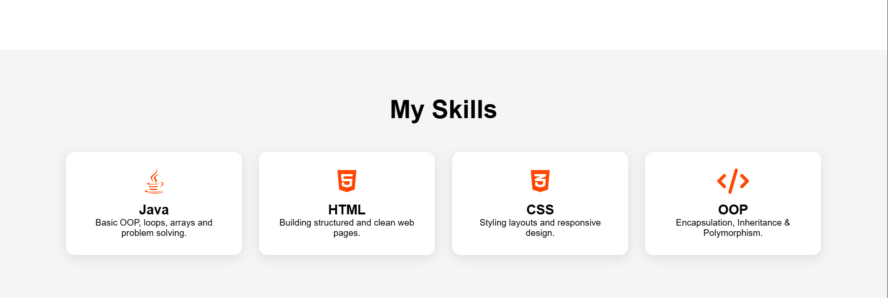

# 🌐 Personal Portfolio Website  

---

## 📌 About the Project  
This is my personal portfolio website built using **HTML and CSS**.  
It showcases my **skills, projects, and frontend development knowledge**.

---

## 🚀 Features  
- ✅ Responsive design  
- ✅ Clean and modern UI  
- ✅ Scroll animations using AOS  
- ✅ Skills showcase section  
- ✅ Structured navigation bar  

---

## 🛠️ Technologies Used  
- 🔹 HTML5  
- 🔹 CSS3  
- 🔹 AOS (Animate On Scroll)  
- 🔹 Font Awesome  

---

## 📷 Preview

  
  

---

## 🎯 Purpose  
This project was created to practice **frontend development** and to build my online presence as a **Computer Science student**.

---
